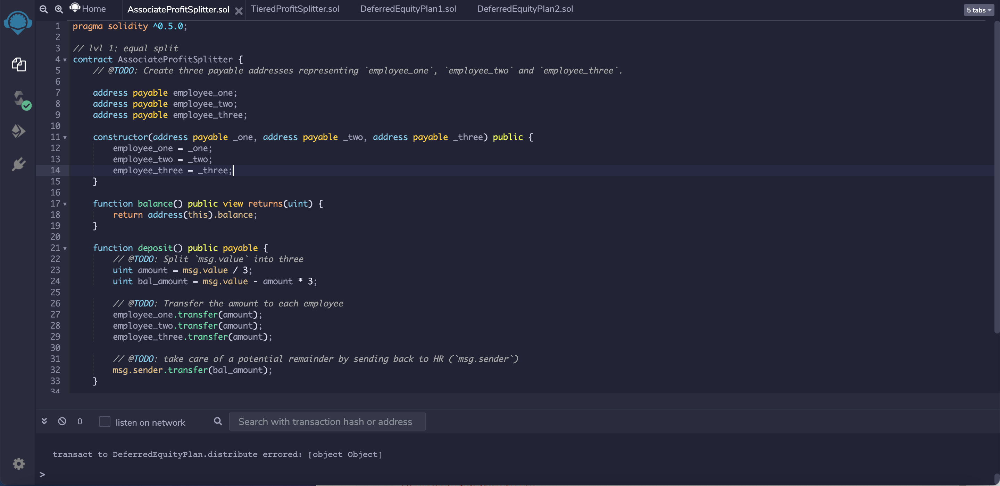
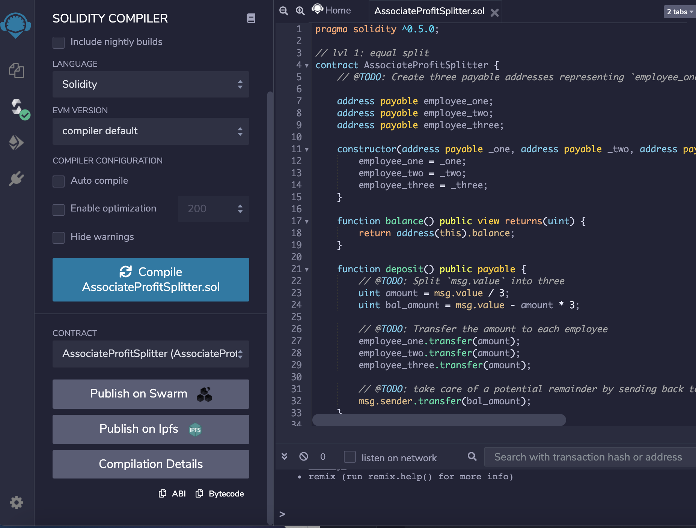
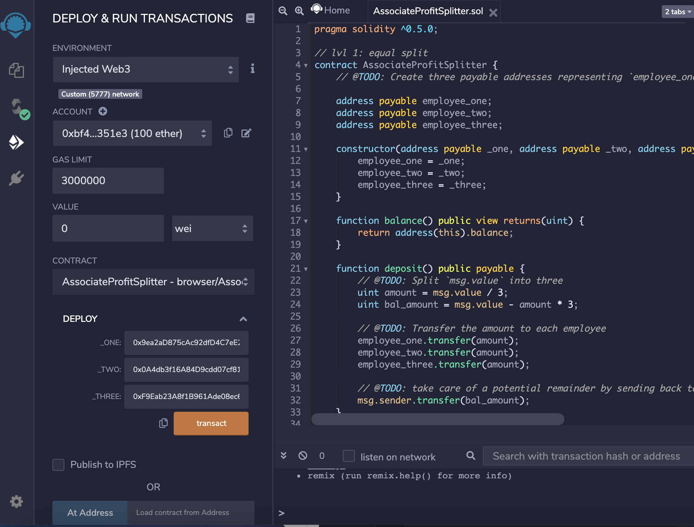
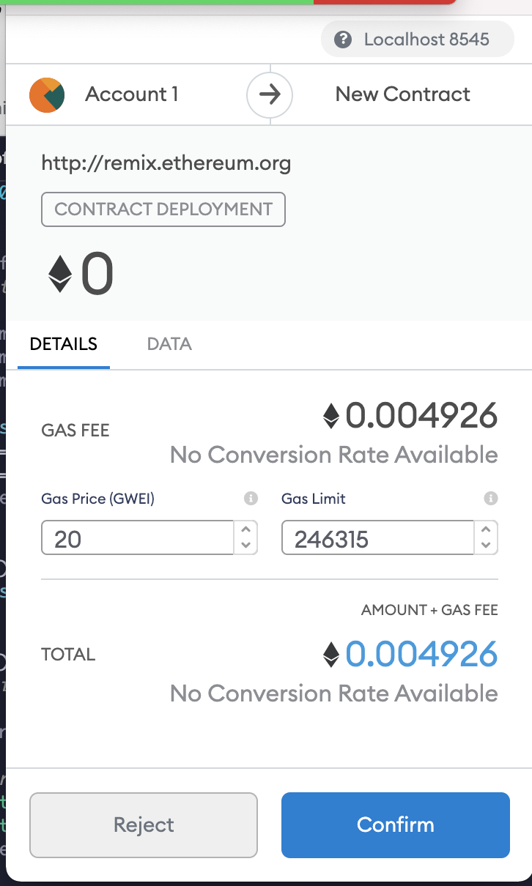
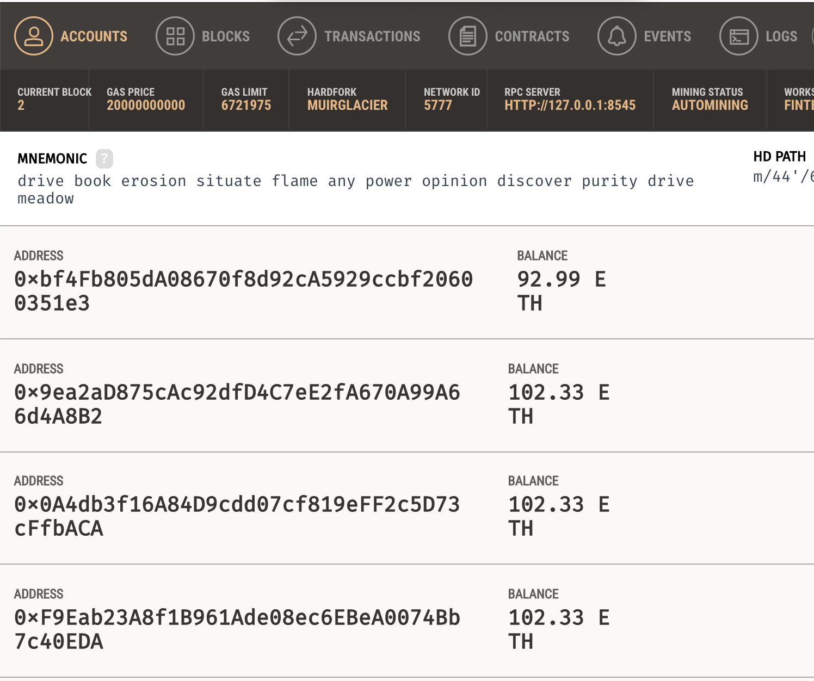
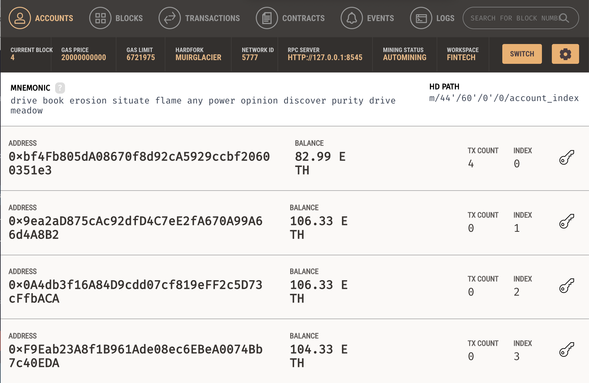

# Solidity Smart Contracts

The task is to build 3 Ethereum-compatible blockchain contracts to distribute profit plans using Solidity smart contracts. The following 3 tools will be used to build the solidity smart contracts: Remix, MetaMask, and Ganache.

For this excercise, we will code and test the smart contracts on our local host. Once we've successfully coded and tested our Smart Contracts, we can deploy them to a public and live ETH blockchain Testnet such as Kovan or Ropsten.

There are 3 levels to building smart contracts for profit plan distributions, with each contract increasing in difficulty, complexity and capability. 

# Level 1: The Associate Profit Splitter Contract

The Associate Profit Splitter will accept Ether into the contract and divide the Ether evenly among the employees. This will allow the Human Resources department to pay employees quickly and efficiently. In this scenario, we will be paying the following employees:
- employee_one 
- employee_two 
- employee_three 

## Solidity Smart Contract Code

## Compiling Smart Contract in Solidity
Next, we need to compile the code in Solidity. The platform will highlight any existing coding errors, it will only compile once all errors are corrected.

The green checkmark indicates no coding errors. From here, we can deploy the smart contract.

## Deploying Smart Contract in Solidity

To begin open Ganache, from where our contract will be executed. In order to deploy the contract, these accounts must be prefunded with expenses that will be destined toward gas payments. 

Simultaneously, make sure you are logged into Metamask on the same network as your Ganache app. 

Prior to deployment choose an account per employee, for a total of three accounts. 

Deploy the smart contract using the "transact" button and then by confirming the transaction via MetaMask.

After the contract is confirmed to be activated, you can carry out a transaction to test it.

# Level Two: The Tiered Profit Splitter Smart Contract

The purpose of the Tiered Profit Splitter is to distribute different percentages of Ether to employees based on levels rather than an equally proportional split. In this case, employee 1 will receive 40%, employee 2 will receive 40% and employee 3 will receive 20%. 

We follow the same steps as Level One, and once the contract has been activated we will test the functionality by transferring Ether into the employees' accounts. You'll see that Ganache wallet balances are now updated. 

# Deploying smart contracts to a live Testnet

Now that we have sucessfully coded and tested our Smart Contracts on our Local Network, you can now deploy all 3 contracts to a live Testnet, [here](https://etherscan.io/). 